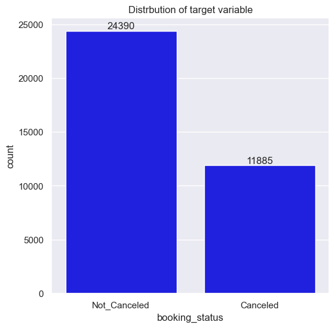
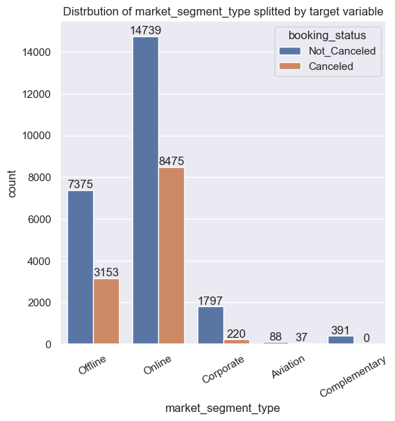
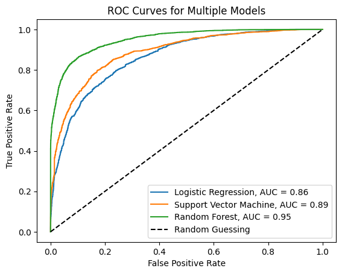
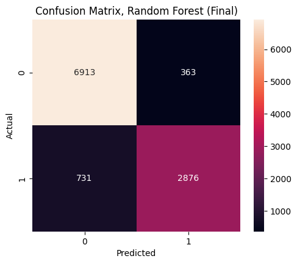
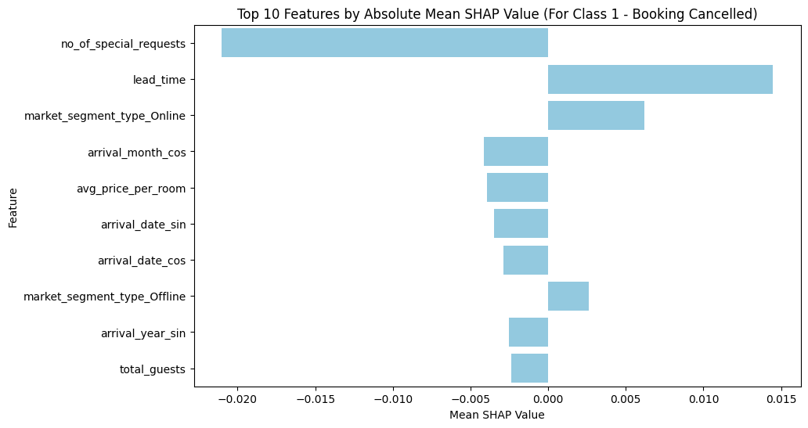

# Hotel Reservations Project

Data source: <https://www.kaggle.com/datasets/ahsan81/hotel-reservations-classification-dataset>

## Description

Dataset contains information about hotel bookings. The goal is to classify whether a booking will be cancelled or not.

## Technologies used

- **Python** 3.10
- **pandas**, **numpy**
- **matplotlib**, **seaborn**
- **scikit-learn**
- **shap**
- **jupyter notebook**

## Repo structure

```a
├── data - all data files are stored here
├── img - images used in README.md
├── src
│   ├── models - trained model objects are stored here
│   ├── notebooks - jupyter notebooks
│   ├── preprocessing - data preprocessing scripts
│   ├── scripts - other scripts
│   └── training - training scripts
├── .gitignore
├── README.md
└── requirements.txt
```

## Project parts

### Exploratory Data Analysis

To understand the data, I performed exploratory data analysis. Important aspect in the classification problem is to check the distribution of the target variable. In our case canceled bookings are 1/3 of all bookings, which is not a big imbalance.



Another step was analyzing the distribution and corralation of features. One of the most interesting findings was that `Complementary` bookings are never canceled.



### Data preprocessing

In the preprocessing and feature engineering step I handled outliers, encoded categorical variables, normalized numerical variables and created new features. All these steps are implemented in the `preprocessing` module, and reasoning behind them is explained in the notebooks. I also split the data into training and testing sets.

### Model training

I trained several models and compared their performance. I used GridSearchCV to find the best hyperparameters for each model. The model were optimized to have the highest possible recall. After finding out that Random Forest performed the best, I trained it on the whole training set and evaluated it on the test set. Here are the results of all optimized models and Confusion Matrix for final Random Forest model:





### Model interpretation

I used SHAP values to check which features were most important for the model, while classifying the booking as canceled.


